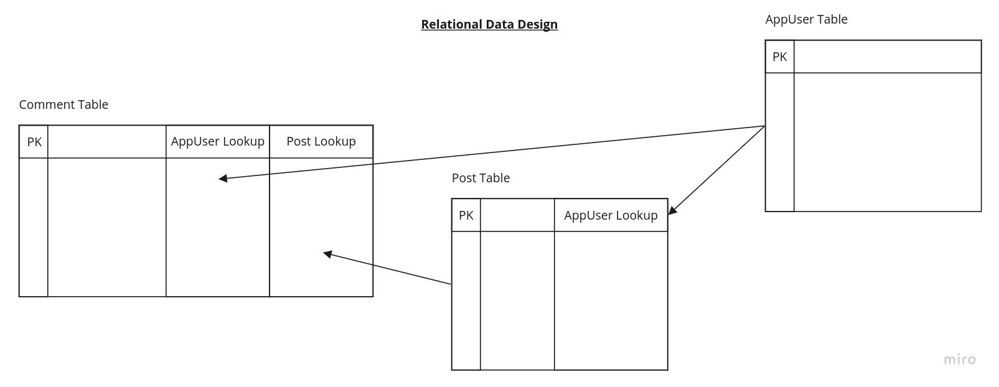

# Database Schema

## Schema Overview

We developed the site to use PostgresQL by default, but any relational SQL DB can be leverage with a little effort.

This is a living document until we deliver at the end of this sprint.

## Entities

AppUser: Represents a registered user.

Post: Represents a Post to the "Question Blog" portion of the size. AppUser can make many of these.

Comment: Represents a Comment made on a Post. AppUser can make many of these. Posts might have zero to infinite number of theses. 

## Data Relationships Design

## CRUD Operations

TBD
