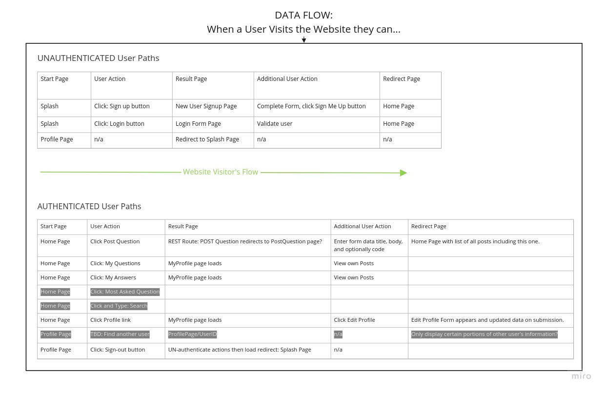

# Requirements

## Vision

StackFellows is designed as a community site for Code Fellows students and alumni to ask questions, get answers, or
otherwise find support during and after their Code Fellows journey.

During a Code Fellows student journey, there are many difficult hurdles to overcome, and StackFellows strives to help!

The site allows users to post questions, write answers and provide support to other users, and allow supporting
answers to other users posts.

StackFellows enables members to upload code samples to help other students, or to ask others for assistance with 
writing or debugging the code.

Members will be able to comment on other members' posts, and can "up vote" comments and posts to promote positive
feedback and support, further promoting an inclusive, and capable Code Fellows community!

## Scope

### In-Scope

- A new user to the site will be able to *register* to become a site user.
- A registered user will be able to log on to the website using their personally chosen username and password.
- A registered logged on user will be able to view and update their own Profile, with links to existing posts and comments they have made.
- A registered logged on user can view other registered users' posts and comments and "up vote" to provide encouragement or support for an answer to a question.
- A registered logged on user will be able to post a question to the site, and view other registered users posts and "up votes".

### Out of Scope

What our product will *not* do:

- Auto correct (spelling or grammar) or validate code.
- Guarantee security of a users password or identity.
- Provide a dynamic user interface for every device size and type i.e. smartphones and smaller tablets.

## Minimum Viable Product

- A web app that enables user to self-register and logon.
- Web app uses a relational database backend.
- Authentication is handled using Spring Security.
- Users can Post, Up-Vote, and Comment.
- At least 2 Entity Models used to track database data.
- A RESTful API is implemented.
- A users post is associated with the user that created it.
- User can share code in their discussion / posts.

### Stretch Goals

- User can "private message" their instructor within the webapp.
- A quick Search utilize allows searching for posts and comments.
- Users can "connect with other Code Fellows alumni".
- Registered users can upload images (i.e. Profile; Screen shot).
- Inspirational quotes will be shown on-screen while a user is logged on.
- Limits will be placed on authorization (i.e. certain users can do certain things, others can not).
- An Administrative user is able to add/remove rights to registered users.

## Functional Requirements

- A website visitor can self-register with their own username and password.
- A registered user can log on to the website.
- Registered, logged on users can make posts, comment on them, and "up vote" other users posts.
- Registered users can see each other's posts and "up votes".

## Dependencies

- Relational Database system such as PostgresQL.
- Spring JPA and JPA Repository.
- Spring MVC.
- Spring Authentication Manager.
- Spring Password Encoder.
- Javax Persistence.
- Spring Security 5.
- Gradle 2.7.x.
- Spring MVC 'hiddenmethod' filter.

## Application Properties

We recommend disabling Whitelabel errors in application.properties with `werver.error.whitelabel.enabled=false`

## Data Flow

