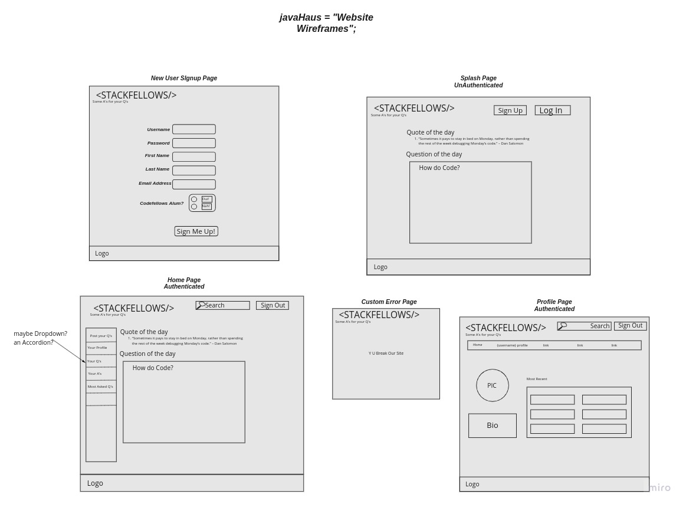
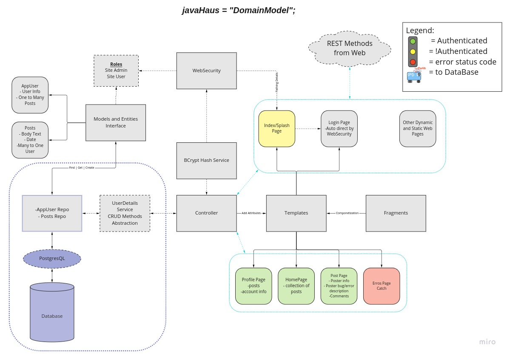

# Stackfellows

## Team Agreements

See these related repos:

[midterm-prep-1](https://github.com/javahaus/midterm-prep-1)

and [midterm-prep-2](https://github.com/javahaus/midterm-prep-2)

## User Stories

We have a large list of stories stored in our Trello Board [here](https://trello.com/b/vgEW8ZaR/javahaus-project) below
is a sampling of those we have implemented:

As a user, I would like to be able to log in with my username and password and easily ask or answer questions
and access the questions I have asked, and the ones I have answered.  The username and password need to be stored
and protected from being visible.

As a Code Fellows student, I would like to be able to ask coding questions where other students, instructors, teaching
assistance and alumni could provide help, suggestions, hints, or detailed answers. I should also be able to ask 
follow-up questions on individual posts from other users.

As a user, I would like to browse through questions asked by others so that I may be able to help a fellow coder. I can 
also try to find answers to a question previously asked.

As a user, I want to be able to copy and paste my related code into a text box to post along with the question that 
I am asking. This will allow me to post the exact code I have (neither auto correct nor intellisense are an MVP goal).

As a user I want the ability to upvote questions that haven't been sufficiently answered and need more visibility. I 
also want to be able to upvote answers that have helped me or contain the answer I believe to be correct and/or the best
way to go about answering the question.

## Software Requirements

Find software requirements in [requirements.md](./PrepDocs/requirements.md)

## Database Schema

See [database-schema.md](./PrepDocs/database-schema.md) for schema, entities, data relationship design, and a 
description of CRUD operations.

## Website Wireframe

### Domain Modeling

## The Team

Code Mastermind [Roger Reyes](https://github.com/RogerMReyes)

Creative Mind Overlord [Jason Wilson](https://github.com/WilsonJhub)

Code Challenge Swashbuckler [Chuck Altopiedi](https://github.com/ChuckAlto)

Git-fu Master [Jon Rumsey](https://github.com/nojronatron)

## References and Attributions

Thymeleaf code to maintain plain text line feeds from [Stack Overflow](https://stackoverflow.com/questions/49849839/spring-thymeleaf-text-next-line)
