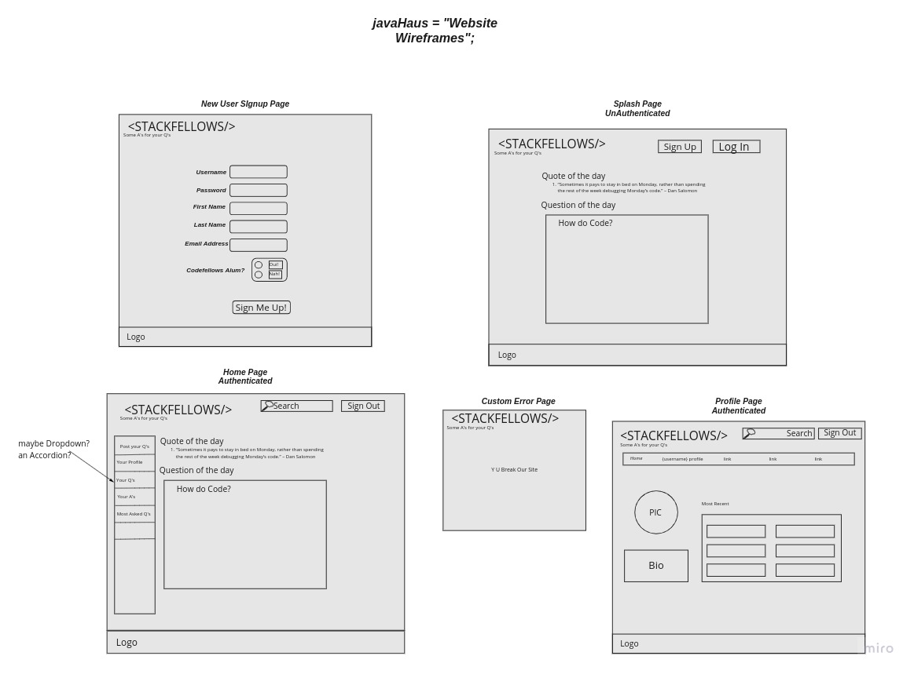
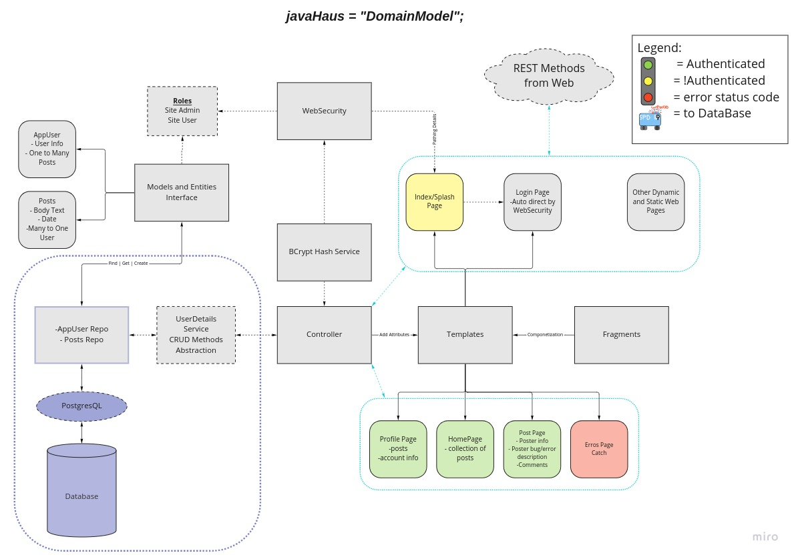

# Stackfellows

## Team Agreements

See these related repos:

[midterm-prep-1](https://github.com/javahaus/midterm-prep-1)

and [midterm-prep-2](https://github.com/javahaus/midterm-prep-2)

## User Stories

We have a large list of stories stored in our Trello Board [here](https://trello.com/b/vgEW8ZaR/javahaus-project)

-[ ] Widdle-down the user stories to as few as are necessary for MVP.

## Software Requirements

Currently under development.

-[ ] Develop and submit a 'requirements.md' to the repo and link it here.

## Design Documentation

### Database Schema

Currently under development.

-[ ] Develop and link-in or add a DB Schema diagram to this readme or link it in the repo.

### Website Wireframe

### Domain Modeling

## The Team

Soft Spoken Code Slinger [Roger Reyes](https://github.com/RogerMReyes)

Creative Mind Overlord [Jason Wilson](https://github.com/WilsonJhub)

Code Challenge Swashbuckler [Chuck Altopiedi](https://github.com/ChuckAlto)

Git-fu Master [Jon Rumsey](https://github.com/nojronatron)
